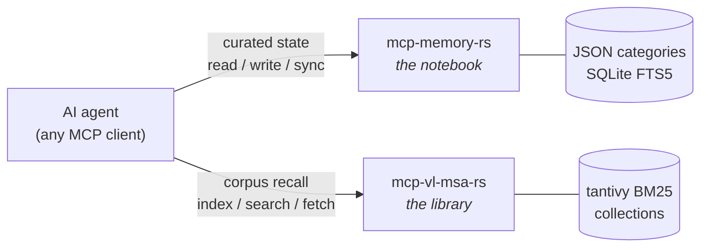

# mcp-memory-rs

Local-first MCP memory server in pure Rust. Persistent, versioned, queryable
memory for AI agents — owned by the user, not by a platform.

State lives on your disk as plain JSON categories backed by SQLite (FTS5).
Every write is versioned and backed up. A fleet of devices syncs through an
optional HTTP endpoint with merkle manifests and optimistic concurrency.
No cloud account, no embedding service, no network dependency in the default
mode.

## Why

Agent memory tied to a vendor dies with the vendor session. This server keeps
the agent's long-lived state — identity, projects, infrastructure notes,
per-device workflows — in files you can read, grep, diff, and back up
yourself. Any MCP client (Claude Code, Codex, or anything speaking MCP stdio)
gets the same memory; swapping the model does not lose the state.

Design choices that follow from that:

- **Local-first**: the stdio server works fully offline against local storage.
  Sync is a separate, explicit step — never a hidden dependency.
- **Plain storage**: one JSON file per category plus a SQLite index. The
  database can be rebuilt from the files; the files are the truth.
- **Versioning by default**: every write keeps history; deletes create a
  backup first. `memory_history` and `memory_compact` manage the tail.
- **Concurrency-safe writes**: `expected_hash` turns clobbering races between
  concurrent agents into explicit conflicts.
- **Zero ML in the core**: full-text search is SQLite FTS5 with BM25;
  `memory_search_semantic` adds an optional TF-IDF hybrid. No model downloads.

> **The pair:** for *corpus* recall (chunked documents, BM25 retrieval,
> original-text injection) see the companion server
> [mcp-vl-msa-rs](https://github.com/DioNanos/mcp-vl-msa-rs). This server holds
> the curated agent state; that one holds the queryable corpus.



## Install

**Prebuilt binary** (recommended) — download the archive for your platform from
the [latest release](https://github.com/DioNanos/mcp-memory-rs/releases/latest),
extract, and point your MCP client at the binary:

```bash
tar xzf mcp-memory-rs-x86_64-unknown-linux-gnu.tar.gz
install -m755 mcp-memory-rs-*/mcp-memory-rs ~/.local/bin/
```

Prebuilt targets (Linux + Android): `x86_64-unknown-linux-gnu`,
`x86_64-unknown-linux-musl`, `aarch64-unknown-linux-gnu`,
`aarch64-unknown-linux-musl` (edge / ARM / Termux), `aarch64-linux-android`.

**macOS**: no prebuilt binary is shipped (it would need Apple code-signing).
Install from source instead — `cargo install` compiles it on your Mac in one
command, no signing needed:

```bash
cargo install --git https://github.com/DioNanos/mcp-memory-rs --locked
```

`--locked` uses the committed `Cargo.lock` (reproducible build).

## Quick start

```bash
cargo build --release

# stdio MCP server, offline mode (default)
./target/release/mcp-memory-rs
```

Claude Code (`~/.claude.json`) or any MCP client:

```json
{
  "mcpServers": {
    "memory": {
      "command": "/path/to/mcp-memory-rs",
      "env": { "MCP_DEVICE": "my-laptop" }
    }
  }
}
```

Codex (`~/.codex/config.toml`):

```toml
[mcp_servers.memory]
command = "/path/to/mcp-memory-rs"
env = { MCP_DEVICE = "my-laptop" }
# auto-approve read-only tools (memory_read/list/search/…); writes still gated
default_tools_approval_mode = "approve"
```

Configuration is TOML — copy [`config/example.toml`](config/example.toml) and
adjust. Environment variables override file values (`MCP_DEVICE`,
`MCP_MEMORY_MODE`, `MCP_MEMORY_DIR`, …); the example file documents all of
them.

## Memory model

Memory is organized in **categories**: named JSON documents (`base`,
`projects`, `my-laptop`, `workflow_my-laptop`, …). Reads return the document
plus metadata (content hash, size, last writer, timestamp). Writes replace the
category or, with `merge=true`, patch it per top-level key.

### Access control

Multi-device fleets get a small, explicit ACL (`[acl]` in the config):

| Rule | Effect |
|---|---|
| `admin_devices` | Listed devices write everything. |
| `device_categories` | Device `name` writes category `name` and `workflow_name` — its own namespace only. |
| agent scope | Device `foo-agent` writes `foo_*` categories. |
| everyone | All devices read everything. |

Unknown categories are denied for non-admin writers — fail closed.

### Fleet sync

Each node runs local-first; one node (or any number) exposes the HTTP API as a
sync remote. `sync_manifest` builds a merkle-rooted fingerprint of all
categories; `sync_diff` compares manifests; `memory_sync` pushes dirty
categories or pulls remote changes. Conflicts between nodes are resolved by
the configured `conflict_strategy` (last-write-wins by default);
`expected_hash` preconditions protect direct writes (MCP and HTTP), not the
sync envelope.

The HTTP API is an **admin/sync plane**: the bearer token grants full access
to every category. Per-category ACL applies on the MCP stdio surface, where
the device identity is known locally; HTTP callers are identified only by the
shared token, so no per-device ACL is enforced there.

The HTTP server **requires** `MCP_MEMORY_TOKEN` and refuses to start without
it. Bind it to loopback (the default) and tunnel between nodes; do not expose
it to the public internet.

```bash
MCP_MEMORY_TOKEN=<secret> ./target/release/mcp-memory-rs --http
```

## Tool surface

| Tool | Description |
|---|---|
| `memory_read` | Read a category (optional field filtering). |
| `memory_write` | Replace or merge-patch a category; versioned; `expected_hash` precondition. |
| `memory_delete` | Delete a category (backup created first). |
| `memory_list` | All categories with hash/size/last-update metadata. |
| `memory_search` | FTS5 full-text search, BM25 ranking, category/date/actor filters, snippets. |
| `memory_search_semantic` | Hybrid TF-IDF + FTS5 search. |
| `memory_history` | Version history of a category. |
| `memory_delta` | Changes since a known hash (cheap polling). |
| `memory_context` | Multi-category warmup read, token-budget oriented. |
| `memory_compact` | Prune old versions and backups. |
| `memory_status` | Local-first status: dirty queue, manifest hash, last sync. |
| `memory_doctor` | Diagnostics: paths, database, categories, sync config. |
| `sync_manifest` | Merkle-rooted manifest of all categories. |
| `sync_diff` | Compare local vs remote manifest: push/pull/conflict sets. |
| `sync_push` / `sync_pull` | Export/import sync envelopes. |
| `memory_sync` | One sync step against the configured remote (`push_dirty` / `pull_remote`). |

The same surface is available over HTTP (`/api/v1/*`) for non-MCP consumers;
`/health` is unauthenticated, everything else requires the bearer token.

### AI client compatibility

The server is built to be self-explanatory to a weak client model:

- At `initialize` it returns an **instructions** string describing the memory
  model and the entry-point tools. Some lightweight clients ignore this field;
  if your client never surfaces it, read the tool descriptions instead — they
  carry the same guidance (e.g. `memory_read` takes `category`, not `key`).
- Read-only tools are annotated `readOnlyHint`, so a client such as Codex can
  auto-approve them. On Codex, an `unsupported call` / `user cancelled`
  result usually means the tool-approval gate fired, not a server fault — set
  `default_tools_approval_mode = "approve"` (see the Codex snippet above).
- The server speaks the standard MCP handshake. A client must complete
  `initialize` and send `notifications/initialized` like any MCP client.

## Storage layout

Default `base_dir` is `~/.memory`; the example config uses
`~/.local/state/mcp-memory-rs` (XDG-style). Either way the layout is:

```
<base_dir>/
├── categories/   # one .json file per category — the source of truth
├── backups/      # automatic pre-delete/pre-overwrite backups
└── memory.db     # SQLite: FTS5 index, versions, sync state (rebuildable)
```

## Building and testing

```bash
cargo build --release   # single static-friendly binary
cargo test              # unit + integration tests
cargo clippy --all-targets -- -D warnings
```

No build-time network access, no C dependencies beyond bundled SQLite.

## License

Apache-2.0. See [LICENSE](LICENSE).
